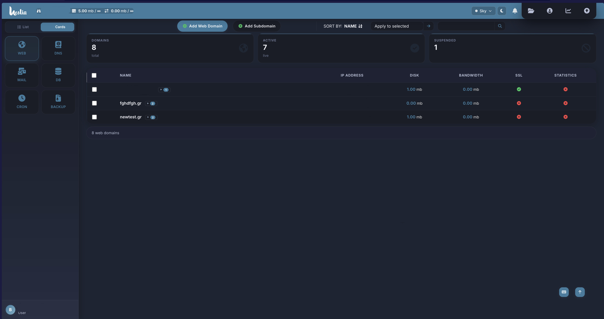
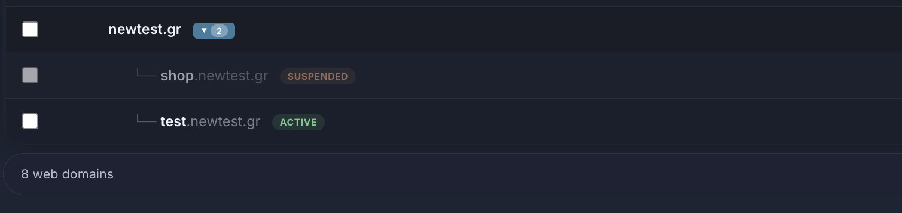
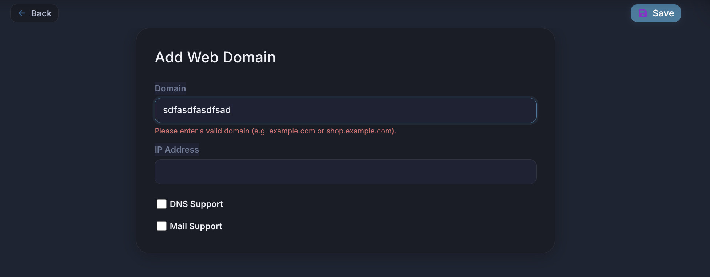
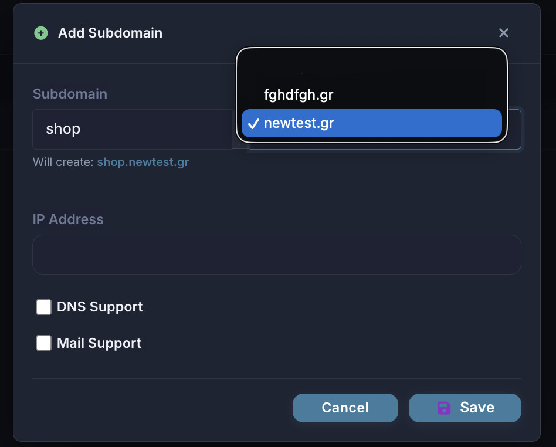

# SubdomainUX-HestiaCP

🇬🇧 [English](#english) | 🇬🇷 [Ελληνικά](#ελληνικά)

---

## 🇬🇧 English

Subdomain visual grouping and improved add-domain UX for the **HestiaCP** control panel.

Subdomains are automatically detected and collapsed under their parent domain in the Web list.
When adding a new domain, a split input lets you type just the label and pick the parent from a dropdown — no more accidentally creating `test` instead of `test.example.com`.

Zero dependencies. Vanilla JS. Survives every HestiaCP update automatically via the built-in hooks system.

---

### Screenshots









---

### How it works

The plugin adds two independent enhancements:

**1. Visual grouping on `/list/web/`**

Reads all domain rows client-side, detects which ones are subdomains of other domains in the same list, and renders them as a collapsible tree under their parent:

```
example.com  [▶ 2]
  └── shop.example.com    Active
  └── test.example.com    Suspended
```

No backend changes. The original rows are reordered and indented client-side.

**2. Add Subdomain button**

A dedicated "Add Subdomain" button appears next to "Add Web Domain". Clicking it opens a modal with a split input and a parent domain dropdown:

```
[ shop ] . [ example.com ▾ ]
Will create: shop.example.com
```

**3. Domain validation on `/add/web/`**

The "Add Web Domain" form now validates the input client-side and prevents invalid entries like `test` (without a TLD) from being submitted.

---

### Repository contents

| File | Purpose |
|---|---|
| `bp-subdomain-ux.js` | Loader — auto-loaded via `custom_scripts/` |
| `subdomain-list.js` | DOM grouping logic for `/list/web/` |
| `subdomain-list.css` | Styles for the grouped list view |
| `subdomain-add.js` | Add Subdomain modal + validation for `/add/web/` |
| `subdomain-add.css` | Styles for the modal and split input |
| `install.sh` | One-line installer |
| `uninstall.sh` | One-line uninstaller |

---

### Requirements

- Linux server running **HestiaCP 1.9.x** or later
- `root` access (installer only)

---

### Installation

```bash
curl -sL https://raw.githubusercontent.com/BytesPulse-OE/SubdomainUX-HestiaCP/main/install.sh | sudo bash
```

Then open HestiaCP → **Web** — subdomains will appear grouped under their parent domain.

---

### Uninstallation

```bash
curl -sL https://raw.githubusercontent.com/BytesPulse-OE/SubdomainUX-HestiaCP/main/uninstall.sh | sudo bash
```

---

### Update

Re-run the install command — idempotent, safe to run multiple times.

---

### What the installer does

1. Creates `/etc/hestiacp/bp-subdomain-ux/` — stores all plugin files in a directory that HestiaCP never touches during upgrades
2. Deploys CSS to `/usr/local/hestia/web/css/bp-subdomain-ux/` and JS to `/usr/local/hestia/web/js/bp-subdomain-ux/`
3. Places the loader at `/usr/local/hestia/web/js/custom_scripts/bp-subdomain-ux.js` — auto-loaded by HestiaCP on every page, exactly like themes
4. Installs or appends to `/etc/hestiacp/hooks/post_install.sh` — runs automatically after every `apt upgrade hestia` to re-deploy all assets

---

### File layout after installation

```
/etc/hestiacp/bp-subdomain-ux/          ← never touched by HestiaCP upgrades
    bp-subdomain-ux.js
    subdomain-list.js
    subdomain-list.css
    subdomain-add.js
    subdomain-add.css

/usr/local/hestia/web/
    css/bp-subdomain-ux/                 ← preserved by HestiaCP
        subdomain-list.css
        subdomain-add.css
    js/bp-subdomain-ux/                  ← preserved by HestiaCP
        subdomain-list.js
        subdomain-add.js
    js/custom_scripts/
        bp-subdomain-ux.js               ← auto-loaded by HestiaCP

/etc/hestiacp/hooks/
    post_install.sh                      ← runs after every apt upgrade hestia
```

---

### Upgrade behaviour

| Component | What happens on `apt upgrade hestia` | Result |
|---|---|---|
| `js/custom_scripts/bp-subdomain-ux.js` | **Never touched** | Loader remains active |
| `/etc/hestiacp/bp-subdomain-ux/*` | **Never touched** | All source files remain intact |
| `css/bp-subdomain-ux/` | **Never touched** | Assets remain deployed |
| `js/bp-subdomain-ux/` | **Never touched** | Assets remain deployed |

---

### Notes

- Subdomain detection is purely client-side: a domain is considered a subdomain if its parent (one level up) also exists in the current user's domain list.
- The Add Subdomain modal fetches IP options and DNS/Mail checkboxes directly from `/add/web/` so it always stays in sync with the server configuration.
- Compatible with HestiaCP's Alpine.js — no async/await, no arrow functions, pure vanilla JS.
- Tested on HestiaCP v1.10.2.

---

### License

MIT

---

### Credits

Developed by **[BytesPulse](https://bytespulse.gr)** — Web Hosting & Domain Registrar, Chalkida, Greece.

If you find this useful, consider giving the project a ⭐ on GitHub and following [BytesPulse-OE](https://github.com/BytesPulse-OE) for future HestiaCP projects.

---

---

## 🇬🇷 Ελληνικά

Οπτική ομαδοποίηση subdomains και βελτιωμένο UX δημιουργίας domain για το **HestiaCP** control panel.

Τα subdomains εντοπίζονται αυτόματα και εμφανίζονται συμπτυγμένα κάτω από το parent domain στη λίστα Web. Κατά τη δημιουργία νέου domain, ένα split input σας επιτρέπει να πληκτρολογήσετε μόνο το label και να επιλέξετε το parent από dropdown — δεν δημιουργείται πια `test` αντί για `test.example.com`.

Χωρίς εξαρτήσεις. Vanilla JS. Επιβιώνει αυτόματα από κάθε ενημέρωση HestiaCP μέσω του ενσωματωμένου συστήματος hooks.

---

### Screenshots


---

### Πώς λειτουργεί

Το plugin προσθέτει τρεις ανεξάρτητες βελτιώσεις:

**1. Οπτική ομαδοποίηση στο `/list/web/`**

Διαβάζει όλες τις γραμμές domain client-side, εντοπίζει ποιες είναι subdomains άλλων domains στην ίδια λίστα, και τις εμφανίζει ως αναδιπλούμενο δέντρο κάτω από το parent:

```
example.com  [▶ 2]
  └── shop.example.com    Active
  └── test.example.com    Suspended
```

**2. Κουμπί Add Subdomain**

Εμφανίζεται δίπλα στο "Add Web Domain" και ανοίγει modal με split input και dropdown επιλογής parent domain:

```
[ shop ] . [ example.com ▾ ]
Will create: shop.example.com
```

**3. Validation στο `/add/web/`**

Η φόρμα δημιουργίας domain επικυρώνει client-side την είσοδο και αποτρέπει μη έγκυρες καταχωρήσεις όπως `test` (χωρίς TLD).

---

### Περιεχόμενα αποθετηρίου

| Αρχείο | Σκοπός |
|---|---|
| `bp-subdomain-ux.js` | Loader — φορτώνει αυτόματα μέσω `custom_scripts/` |
| `subdomain-list.js` | Λογική ομαδοποίησης DOM για το `/list/web/` |
| `subdomain-list.css` | Στυλ για την ομαδοποιημένη προβολή λίστας |
| `subdomain-add.js` | Modal Add Subdomain + validation |
| `subdomain-add.css` | Στυλ για το modal και το split input |
| `install.sh` | One-line installer |
| `uninstall.sh` | One-line uninstaller |

---

### Απαιτήσεις

- Linux server με **HestiaCP 1.9.x** ή νεότερο
- Πρόσβαση `root` (μόνο για τον installer)

---

### Εγκατάσταση

```bash
curl -sL https://raw.githubusercontent.com/BytesPulse-OE/SubdomainUX-HestiaCP/main/install.sh | sudo bash
```

---

### Απεγκατάσταση

```bash
curl -sL https://raw.githubusercontent.com/BytesPulse-OE/SubdomainUX-HestiaCP/main/uninstall.sh | sudo bash
```

---

### Τι κάνει ο installer

1. Δημιουργεί τον φάκελο `/etc/hestiacp/bp-subdomain-ux/` — εκτός εμβέλειας αναβαθμίσεων HestiaCP
2. Αναπτύσσει CSS και JS στους αντίστοιχους φακέλους του HestiaCP web
3. Τοποθετεί τον loader στο `js/custom_scripts/` — φορτώνει αυτόματα από το HestiaCP σε κάθε σελίδα
4. Εγκαθιστά ή προσαρτά στο `/etc/hestiacp/hooks/post_install.sh` — εκτελείται αυτόματα μετά από κάθε `apt upgrade hestia`

---

### Άδεια χρήσης

MIT

---

### Credits

Αναπτύχθηκε από την **[BytesPulse](https://bytespulse.gr)** — Web Hosting & Domain Registrar, Χαλκίδα, Ελλάδα.

Αν το βρείτε χρήσιμο, δώστε ένα ⭐ στο GitHub και ακολουθήστε το [BytesPulse-OE](https://github.com/BytesPulse-OE) για μελλοντικά HestiaCP projects.
